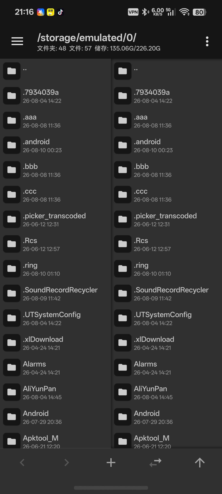
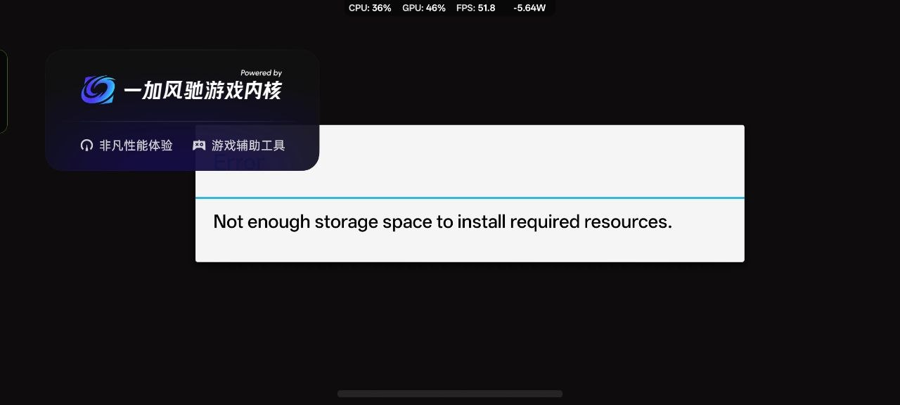

# 正在施工中 #
# PurpleMi Kernel #
适用机型（Supported Models）：红米 Note 9 Pro（gauguinpro）

系统范围（System Scope）：Android 11 - 16 QPR0（不限底子，实测ColorOS15能正常开机）

原仓库（Original Storage）：https://github.com/Fucking-Projekt/android_kernel_xiaomi_gauguin 

## 目前只移除了原仓库中里的SukiSU Ultra + SusFS 1.5.12（为后面的ReSukiSU + SusFS做铺路）并添加了ZRAM LZO和KernelPatch支持，尽情期待
## So far, we’ve only removed SukiSU Ultra + SusFS 1.5.12 from the original repository to pave the way for the upcoming ReSukiSU + SusFS, while also adding support for ZRAM LZO and KernelPatch. Stay tuned!

| 内核版本（Kernel Version） | 
|----------------|
| 4.19.325-PurpleMiKernel-ForGauguinpro |

ROOT方案（ROOT Solution）：ReSukiSU（Inline Hook）

SusFS：是（yes）

支持KernelPatch（Support KernelPatch）：是（yes）

## 内置组件与功能（Kernel-Integrated Components & Features）
| 功能（Function） | 状态（Status） |
|---------|-------------|
| **ReKernel** | 尚未开工（Not Started Yet） |
| **DroidSpaces** | 尚未开工（Not Started Yet） |
| **BBG（BaseBand Guard）** | 尚未开工（Not Started Yet） |
| **尽情期待（Stay tuned）** | 尽情期待（Stay tuned） |

## Bug
## 1.应用/终端 无法正确访问 /sdcard（App/Shell can‘t access /sdcard correctly）（严重 Critical）

MT管理器可以访问/sdcard（已授权Root，没有测试普通权限）

游戏启动时显示没有空间（这里拿rhythm hive来演示），部分app会显示无法访问存储卡

## 2.你告诉我 （You tell me）
